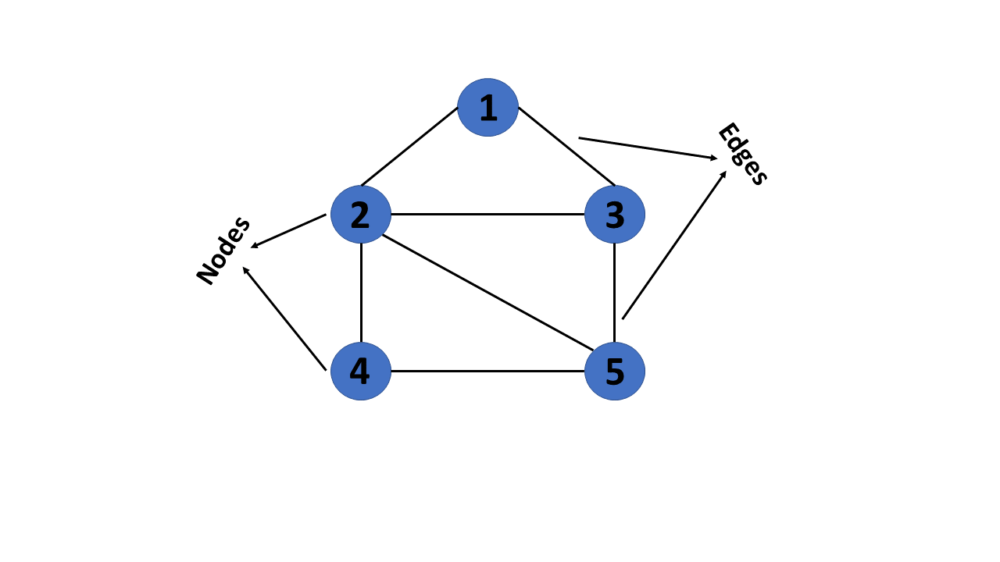
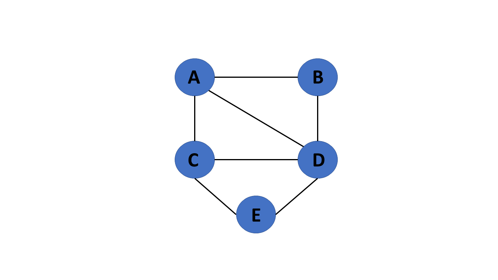
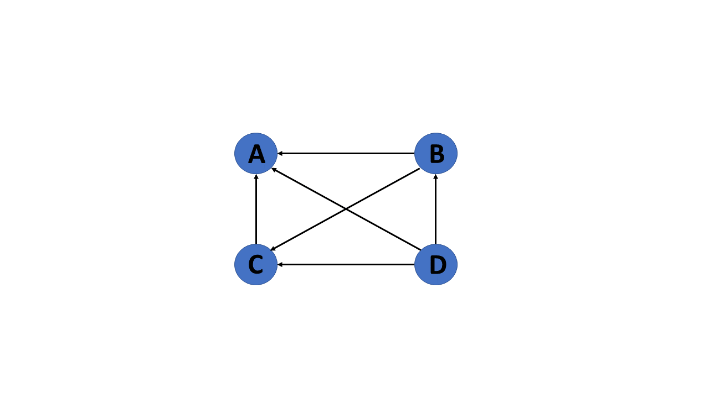
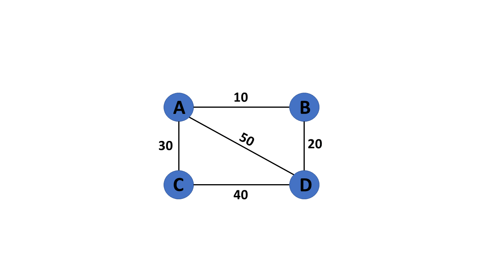
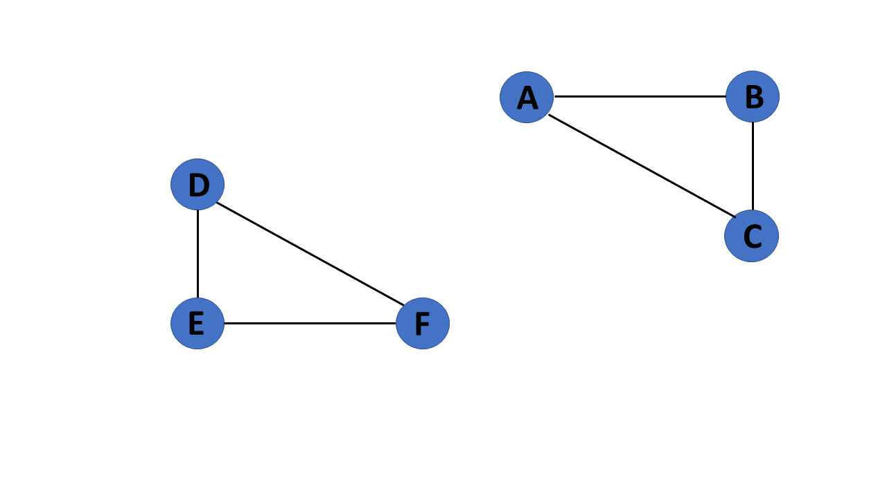
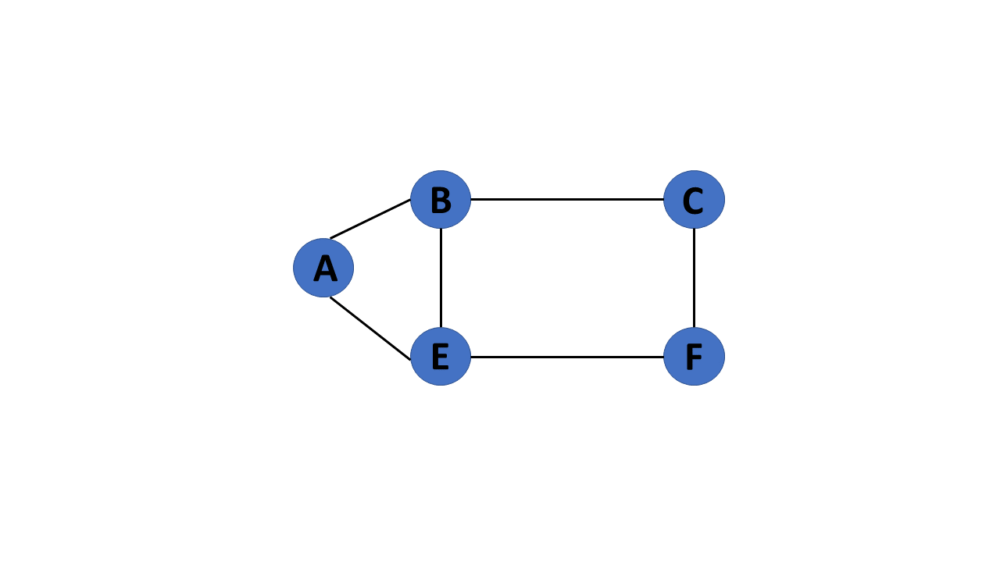
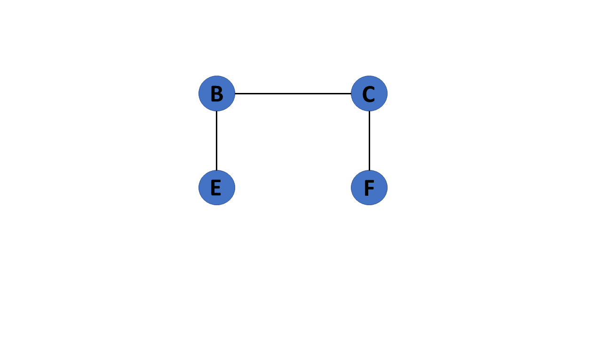

# Graph

## What is graph

A graph is a collection of nodes(vertex) and edges that connect them.

## Types of Graph

### Undirected Graph

An undirected graph is a graph in which all edges are bidirectional, meaning they have no direction. If there is an edge connecting vertex A to vertex B, it implies that vertex B is also connected to vertex A.

### Directed Graph

A directed graph also referred to as a digraph, is a set of nodes connected by edges, each with a direction.

### Weighted Graph

A graph G= (V, E) is called a labeled or weighted graph because each edge has a value or weight representing the cost of traversing that edge.

### Connected Graph

A connected graph is a graph that contains only one connected component.

### Disconnected Graph

A disconnected graph is a graph that contains two or more connected components.

### Cyclic Graph

If a graph contains at least one graph cycle, it is considered to be cyclic.

### Acyclic Graph

When there are no cycles in a graph, it is called an acyclic graph.

